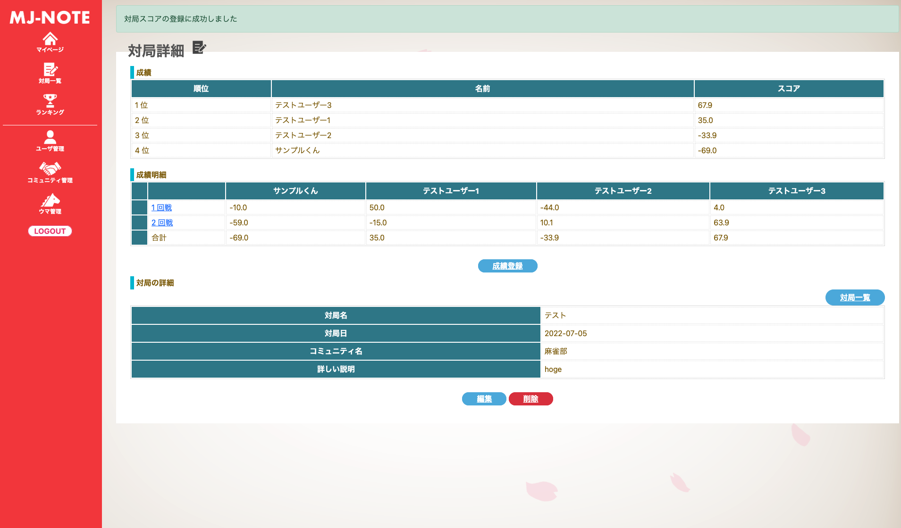
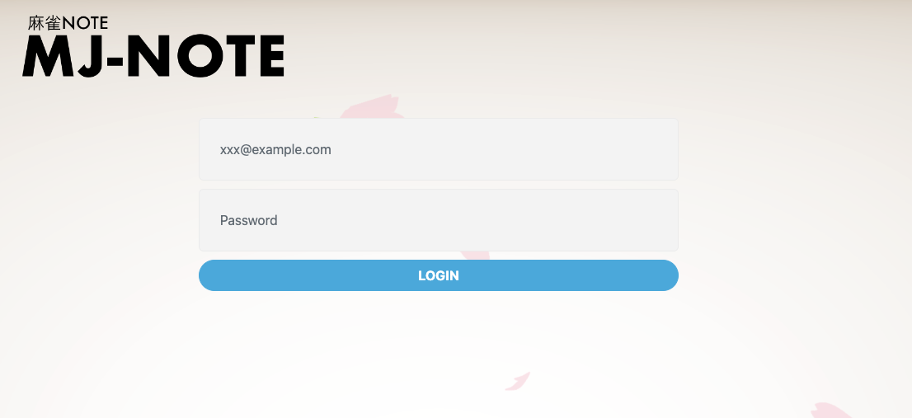
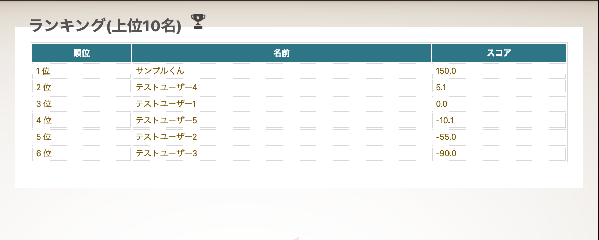
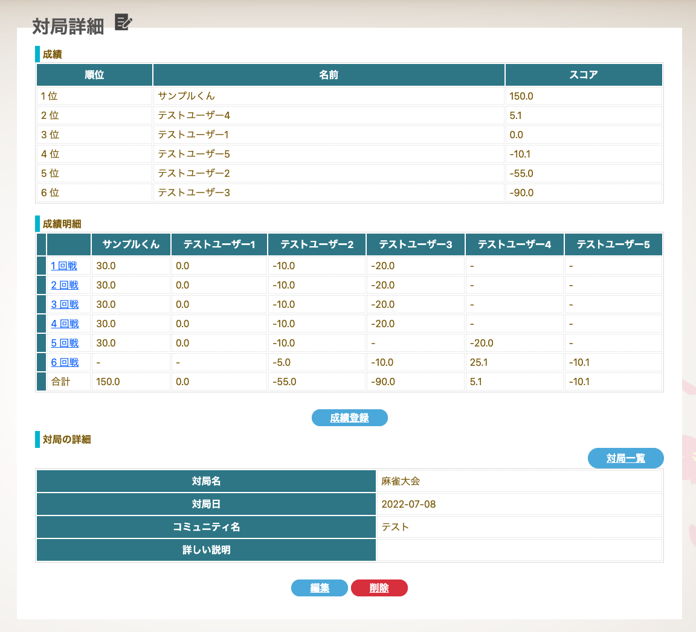
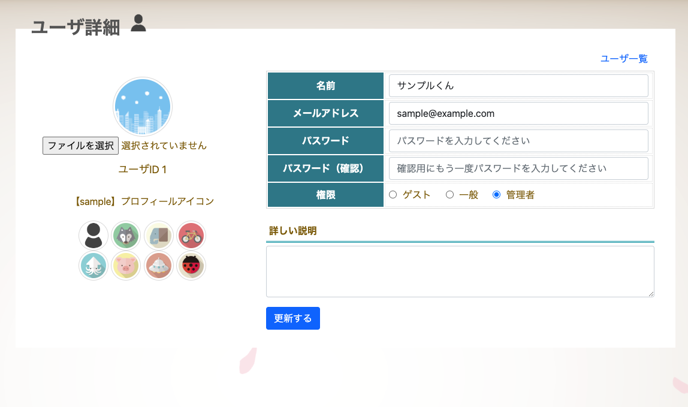

# MJ-NOTE


## 🀄️Overview



- 麻雀の成績管理をするRailsアプリケーションです
- 対局終了時の点数を入力することで、スコア計算されて登録されます
- 過去の成績を照会、自分の成績を確認することができます

### 🀅ログインページ



### 🀅ランキングページ



### 🀅対局詳細ページ



### 🀅ユーザー登録ページ



### 🀅その他

- イベント管理機能
- ウマ管理機能

## 🀄️Setup

### 1. clone

```bash
git clone git@github.com:halkt/mj_app.git
```

### 2. build

```bash
docker-compose up -d --build
```

### 3. db migrate

```bash
docker-compose run --rm app db:create
docker-compose run --rm app db:migrate
docker-compose run --rm app db:seed
```

## 🀄️Demo

### 1. access

http://localhost/

### 2. login

- id: sample@example.com
- pw: simple@sample

## 🀄️Memo

### rspec

```bash
docker-compose run --rm app rspec
```

### rubocop

```bash
docker-compose run --rm app rubocop ${file_name}
```

## 🀄️environment

- Ruby (2.6.5)
- Ruby on Rails (5.2.6)
